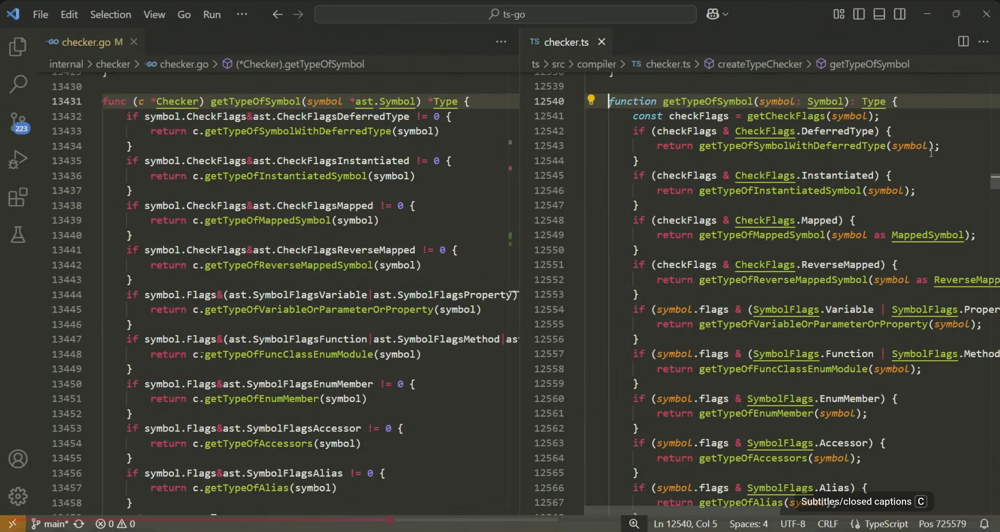
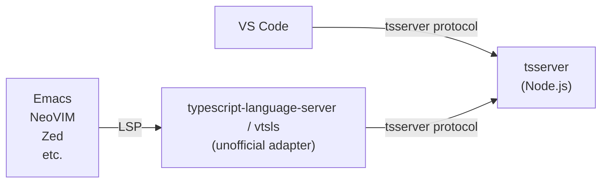
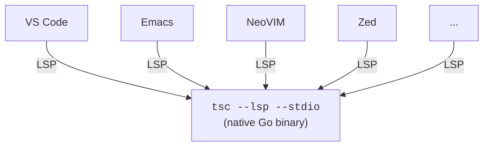
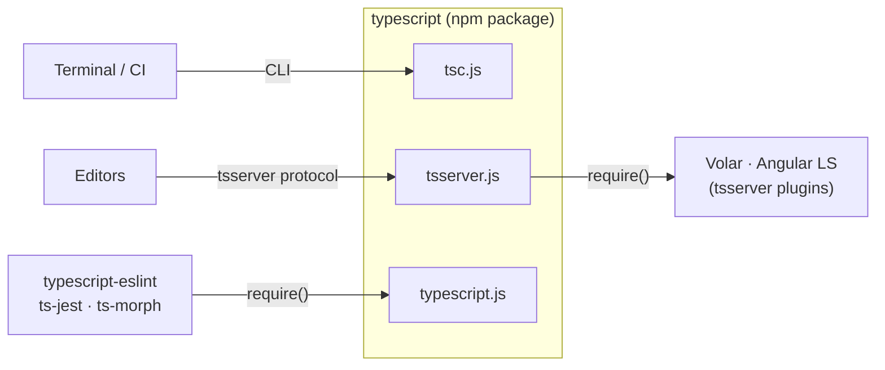
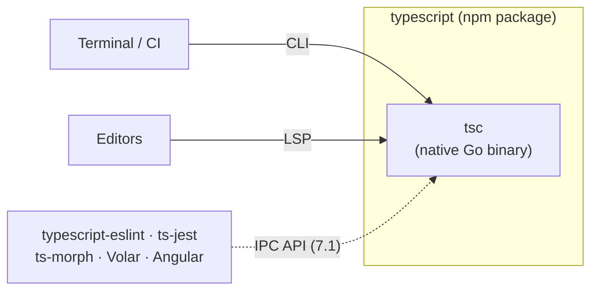
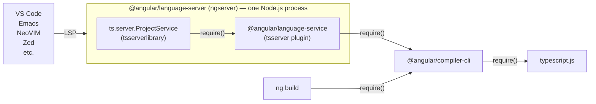

---
# try also 'default' to start simple
theme: "@puzzleitc/slidev-theme-puzzle"
# random image from a curated Unsplash collection by Anthony
# like them? see https://unsplash.com/collections/94734566/slidev
# background: https://cover.sli.dev
# some information about your slides (markdown enabled)
title: "TypeScript 7 – A Fast, Native Port"
info: |
  ## TypeScript 7 – A Fast, Native Port
  Puzzle Tech Kafi, 17.09.2026
# https://sli.dev/features/drawing
drawings:
  persist: false
# slide transition: https://sli.dev/guide/animations.html#slide-transitions
transition: slide-left
# enable Comark Syntax: https://comark.dev/syntax/markdown
comark: true
# duration of the presentation
duration: 35min
layout: cover
---

# TypeScript 7 A Fast, Native Port

Puzzle Tech Kafi, 17.09.2026 \
Mathis Hofer \
<a href="mailto:hofer@puzzle.ch">hofer@puzzle.ch</a>

---
layout: quote
class: text-center
---

# 125.7s → 10.6s

VS Code (2.3M LOC) built with TypeScript 7.0: \
11.9x faster, 18% less memory ([source](https://devblogs.microsoft.com/typescript/announcing-typescript-7-0/))

---
layout: agenda
---

# Agenda

- Act I — Why port TypeScript to Go?
- Act II — What changes with TypeScript 7.0?
- Act III — Can you use it?
- Three things to take away

---
layout: intro
---

# Act I Why port TypeScript to Go?

---

# A self-hosted compiler

Since development started in 2010, `tsc` has always been **TypeScript, compiling TypeScript on Node.js**.

- Eat your own dogfood → part of own ecosystem
- Runs everywhere, even in browser

---

# The limits of self-hosting

- No shared-memory concurrency (single-threaded)
- Performance penalty (2-3x worse than native code)
- Memory ceiling (V8 heap limit → "JavaScript heap out of memory" on big monorepos)

→ It scaled with the codebases — until it didn't.

---

# The slow part was never the build

What people mean when they say "TypeScript is slow":

- Open a file in a large codebase → **17.5s*** before you see the first error
- Autocomplete that arrives after you've finished typing
- Language server crashes, "TypeScript server restarted"

* VS Code code base with TS6

---

# Meanwhile, everything else got fast 🚀

esbuild, swc, oxc, Biome, Vite, Bun — a whole generation of native tooling.

→ Bundling and transpiling went from seconds to milliseconds.

**But none of them type-check, they only strip types!**

Erasing `: string` is easy. Deciding whether `: string` is _correct_
is the hard part, and it is the entire value of TypeScript.

→ `tsc` ended up the slowest step in a toolchain that was otherwise instant.

---

# Native implementation

**Rewrite**

- huge effort
- new structure
- new logic
- different output

**Port**

- manageable effort
- same structure
- same logic
- same output

> Boring, compatible and shipped beats exciting and subtly different.

---

# The plan: TypeScript 7.0

- No new type-system features
- No new syntax
- A faithful port, deliberately

→ Code that compiles cleanly under TS 6.0 (with `stableTypeOrdering` on, no `ignoreDeprecations`) compiles identically under 7.0.

---

# Why Go? And not Rust?

The existing compiler is closures, higher-order functions and **cyclic graphs**,
all **garbage-collected**.

- **Go** maps onto that almost 1:1 — GC, structural types, first-class functions, real concurrency
- **Rust's** ownership model would have forced a redesign of exactly those data structures

→ This is not a dunk on Rust. Different tool, different job.

---
layout: center
---

# Why Go? And not Rust?

<iframe width="560" height="315" src="https://www.youtube.com/embed/cywK3XYYJ2o?si=QK5UiEvZt5V6PhNA&amp;start=635" title="YouTube video player" frameborder="0" allow="accelerometer; autoplay; clipboard-write; encrypted-media; gyroscope; picture-in-picture; web-share" referrerpolicy="strict-origin-when-cross-origin" allowfullscreen></iframe>

---
layout: center
---

# Did they port it all with AI?

<iframe width="560" height="315" src="https://www.youtube.com/embed/cywK3XYYJ2o?si=1LtSNgcJiNwIKR-K&amp;start=904" title="YouTube video player" frameborder="0" allow="accelerometer; autoplay; clipboard-write; encrypted-media; gyroscope; picture-in-picture; web-share" referrerpolicy="strict-origin-when-cross-origin" allowfullscreen></iframe>

---

# Direct port from TypeScript to Go

<Transform :scale="0.8" origin="top center">

→ Converter they used: [github.com/jakebailey/ts-to-go](https://github.com/jakebailey/ts-to-go)

</Transform>

---

# 16 months to TypeScript 7.0

|              |                                                                                      |
| ------------ | ------------------------------------------------------------------------------------ |
| **Mar 2025** | "A 10x Faster TypeScript" — Anders Hejlsberg announces the Go port, codename _Corsa_ |
| **May 2025** | `npx tsgo` — anyone can try the preview                                              |
| **Dec 2025** | Public progress report                                                               |
| **Mar 2026** | **TypeScript 6.0** — the bridge release                                              |
| **Jul 2026** | **TypeScript 7.0** — generally available                                             |

→ 6.0 exists to carry the deprecations and give everyone a migration step.

---
layout: center
class: text-center
---

# `tsgo` → `tsc`

For 16 months the preview binary was called **`tsgo`**

In 7.0 `tsgo` is gone, `tsc` _is_ the native compiler now.

---
layout: intro
---

# Act II What changes with TS 7.0?

---

# The numbers

<CompareBars
  :rows="[
    { name: 'VS Code',    sub: '2.3M LoC', before: 125.7, after: 10.6, speedup: '11.9x' },
    { name: 'Sentry',     sub: '1.9M LoC', before: 139.8, after: 15.7, speedup: '8.9x' },
    { name: 'Bluesky',    sub: '628K LoC', before: 24.3,  after: 2.8,  speedup: '8.7x' },
    { name: 'Playwright', sub: '528K LoC', before: 12.8,  after: 1.47, speedup: '8.7x' },
    { name: 'tldraw',     sub: '345K LoC', before: 11.2,  after: 1.46, speedup: '7.7x' },
  ]"
/>

→ 8–12x on full builds, 6–26% less memory

---

# Where does speed come from?

**1. Native code**

- No JIT warm-up, no interpreter, no Node.js startup
- Compact memory layout → far less GC pressure

**2. Shared-memory concurrency**

- Parsing and checking spread across all your cores
- Simply not available to the JS implementation

<!--
Parsing source files and building AST in memory is completely parallelizable.
-->

---
layout: center
---

# Concurrency gains & LSP improvements

<iframe width="560" height="315" src="https://www.youtube.com/embed/OytpXXeNmTQ?si=SfU3Bhpn6_toTfiM&amp;start=387" title="YouTube video player" frameborder="0" allow="accelerometer; autoplay; clipboard-write; encrypted-media; gyroscope; picture-in-picture; web-share" referrerpolicy="strict-origin-when-cross-origin" allowfullscreen></iframe>

---
layout: center
class: text-center
---

# But the editor is where you feel it

VS Code code base, time to first error:

**17.5s → 1.3s** (13x)

---

# Real teams, real numbers

**Slack**

- CI type-checking **7.5 min → 1.25 min**
- 40% of merge queue time eliminated
- Local development previously "almost unusable"

**Canva**

- Time to first error in the editor **58s → 4.8s**

---

# Editor integration with 6.0

- No official LSP support
- VS Code: Talks to tsserver directly (hardcoded special case)
- First requested in issue 2016

---

# Editor integration with 7.0

- Official LSP support → every editor is now first-class → feature parity
- Adapter/runtime are gone → one native binary
- Fast & reliable
  - **80%** fewer failing language server commands
  - **60%** fewer server crashes
- tsserver plugins are gone (used by Angular, Svelte, Vue etc.)

---

# Tooling integration with 6.0

→ One npm package, three entry points, all JavaScript.
Everything was a `require()` away — **in both directions**.

---

# Tooling integration with 7.0/7.1

- Nothing can be loaded _into_ a Go process → everything must cross a process boundary
- 7.0 exposes a CLI and an LSP server — **but no library and plugin API**
- 7.1 is expected to ship a new IPC API – **completely new extension model**

---

# New tsconfig.json defaults in 6.0

- `strict: true`
- `module: "esnext"`
- `target` is latest stable ES version
- `types: []` **was `["*"]`, will no more automatically include `@types/*` packages in `node_modules`**
- `rootDir: "./"` (no longer inferred)
- `stableTypeOrdering: true` (cannot be turned off)

---

# Deprecated in 6.0, removed in 7.0

- Legacy ECMAScript targets (ECMAScript 5)
- Legacy module targets (System, AMD, UMD)
- Legacy module resolution modes
- ...and some more

→ You're fine if on ESM with bundler resolution.

---

# What does _not_ change

- The type system
- The syntax
- The errors you get

→ Same language. Different engine.

---
layout: intro
---

# Act III Can you use it?

---

# The question that decides everything

**Does it _run_ `tsc`?**

- Type-check in CI
- Building of a library
- Editor via LSP

→ Mostly works **today**

**Does it _embed_ it?**

- Lint rules that need types
- Template type-checking
- AST tooling, transformers

→ Must wait for **7.1**

---

# Where we are today (September 2026)

| Tool                    | TS 7.0? | Notes                                              |
| ----------------------- | ------- | -------------------------------------------------- |
| `tsc` in CI / libraries | ✅      | Just bump the dependency                           |
| Editors via LSP         | ✅      | Use new native language service, no adapter needed |
| **Next.js**             | ✅      | 16.3+, runs your local `tsc`                       |
| **Angular**             | ❌      | On roadmap, no date                                |
| **typescript-eslint**   | ❌      | Work started, no date                              |
| ESLint type-aware rules | ❌      | Blocked on typescript-eslint                       |
| ts-jest, ts-loader etc. | ❌      | All need to adapt to 7.1 IPC API                   |

---

# Next.js — works today

Since 16.3, `next build` runs your project-local `tsc` instead of loading the JS API.

- Works with TypeScript 7.0, enabled by default
- Diagnostics come straight from `tsc` — no Next.js code frames
- Checks the whole `tsconfig` project, including tests
- Still flagged experimental

→ See [Using TypeScript7](https://nextjs.org/docs/app/api-reference/config/typescript#using-typescript-7) (Next.js documentation)

---

# Angular — not yet 😧

Current architecture with 6.0:

> (...) Angular has perhaps one of the deepest integrations with the TypeScript compiler, which will require bigger architectural changes to support new tsgo-based workflows for both the compiler and language service.   We're in the process of prototyping and exploring what this support would look like, and will deliver an Angular compiler that is compatible with tsgo and brings the performance benefits of Microsoft's native port to the Angular ecosystem.

Source: [Angular Roadmap](https://angular.dev/roadmap#developer-velocity)

---

# What can you do to upgrade?

1. **Upgrade to TypeScript 6.0 now** — `stableTypeOrdering` on, clear the deprecations
2. **Tidy your tsconfig** — `rootDir`, `types`, drop `baseUrl`
3. **Upgrade to TypeScript 7.0**, once everything is compatible

→ The migration work is the 6.0 work

---

# The road ahead to 7.1

|                |                                                               |
| -------------- | ------------------------------------------------------------- |
| **06.10.2026** | 7.1 Beta                                                      |
| **10.11.2026** | 7.1 RC                                                        |
| **24.11.2026** | **7.1 Stable** — Content Mapper, Emit & Language Service APIs |

→ See [TypeScript 7.1 Iteration Plan](https://github.com/microsoft/TypeScript/issues/63703)

---
layout: intro
---

# Three things to take away

---
layout: center
---

1. **Same language, different engine** \
   No new syntax, no new types. A port, deliberately.

---
layout: center
---

2. **The missing API is a blocker, but it has a date** \
   7.1 stable on 24 Nov 2026.

---
layout: center
---

3. **Your migration work is the 6.0 work** \
   Do it now, get 7.0 for free.

---

# Sources

Articles:

- [A 10x Faster TypeScript](https://devblogs.microsoft.com/typescript/typescript-native-port/), March 2025 (official announcement)
- [Announcing TypeScript 7.0](https://devblogs.microsoft.com/typescript/announcing-typescript-7-0/), July 2026 (release post)

Videos:

- [Creator of TypeScript: 10x Faster Typescript, Why AI Won't Replace SWEs](https://www.youtube.com/watch?v=cywK3XYYJ2o), August 2026 (interview with Anders Hejlsberg)
- [A 10x Faster TypeScript with Anders Hejlsberg](https://www.youtube.com/watch?v=UJfF3-13aFo), May 2025 (lengthy technical talk)
- [A 10x faster TypeScript ](https://www.youtube.com/watch?v=pNlq-EVld70) (short announcement & demo)

---
layout: end
---

# Thanks! Questions?

Slides: [github.com/hupf/techkafi-typescript7](https://github.com/hupf/techkafi-typescript7) (CC BY-SA 4.0)

<PoweredBySlidev mt-10 />
